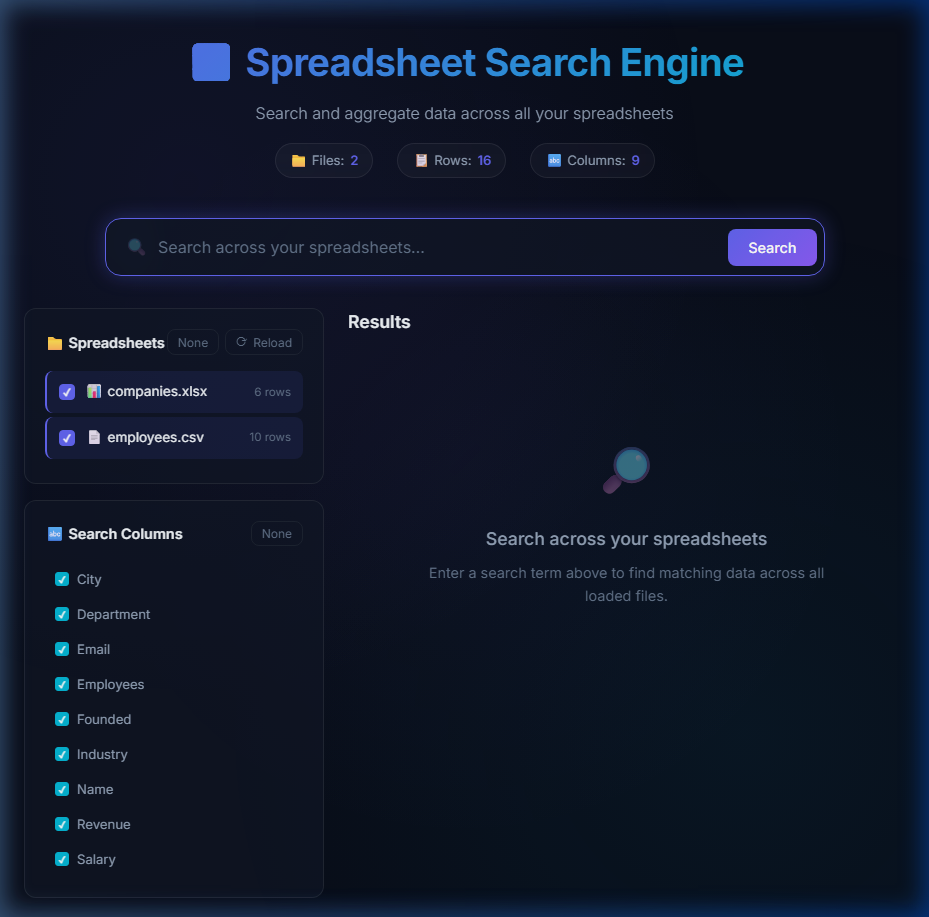
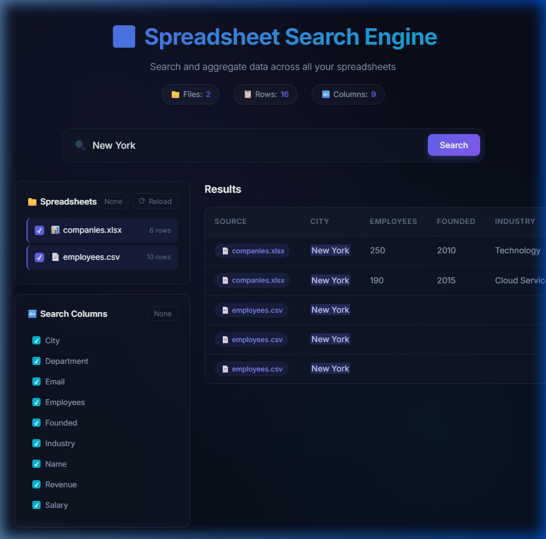

# 📊 Spreadsheet Search Engine

A modern web application that lets you search across multiple spreadsheets (CSV & Excel) and view aggregated results in one place. Built with Python (Flask + pandas) and a sleek dark-themed frontend.


---

## ✨ Features

- **Multi-format support** — Reads both `.csv` and `.xlsx` (Excel) files
- **Cross-file search** — Search across all spreadsheets simultaneously
- **Column filtering** — Select which columns to search in
- **File filtering** — Choose which spreadsheets to include in searches
- **Aggregated results** — Results from all files displayed in one table with source badges
- **Match highlighting** — Search terms are highlighted in results
- **Live reload** — Add or remove spreadsheets and reload without restarting
- **Modern UI** — Dark glassmorphism theme with smooth animations

---

## 🖼️ Screenshots

### Initial View
The app auto-detects all spreadsheets in the `data/` folder and displays file/column metadata:



### Search Results
Search "New York" returns aggregated results from both CSV and Excel files:



---

## 🚀 Getting Started

### Prerequisites

- **Python 3.10+** installed on your system
- **pip** (Python package manager)

### Installation

1. **Clone the repository**
   ```bash
   git clone https://github.com/YOUR_USERNAME/spreadsheet-search-engine.git
   cd spreadsheet-search-engine
   ```

2. **Install dependencies**
   ```bash
   pip install -r requirements.txt
   ```

3. **Add your spreadsheets**

   Place your `.csv` and/or `.xlsx` files in the `data/` directory:
   ```
   data/
   ├── your_file_1.csv
   ├── your_file_2.xlsx
   └── ...
   ```

4. **Run the application**
   ```bash
   python app.py
   ```

5. **Open in browser**

   Navigate to [http://localhost:5000](http://localhost:5000)

---

## 📖 Usage

### Searching
1. Type your search query in the search bar
2. Press **Enter** or click the **Search** button
3. Results from all matching spreadsheets appear in a single table

### Filtering by Columns
- Use the **Search Columns** panel in the sidebar to select/deselect columns
- Click **None** to deselect all, then pick specific columns
- Only selected columns are searched

### Filtering by Files
- Use the **Spreadsheets** panel to include/exclude specific files
- Click **None** to deselect all, then pick specific files

### Reloading Data
- After adding or removing spreadsheet files from the `data/` folder, click the **⟳ Reload** button in the sidebar
- The app will re-scan the directory and update the file/column lists

---

## 📁 Project Structure

```
spreadsheet-search-engine/
├── app.py                  # Flask backend & search API
├── requirements.txt        # Python dependencies
├── README.md               # This file
├── .gitignore              # Git ignore rules
├── data/                   # Place your spreadsheets here
│   ├── employees.csv       # Sample CSV data
│   └── companies.xlsx      # Sample Excel data
├── static/
│   ├── css/
│   │   └── style.css       # Dark theme & glassmorphism styles
│   └── js/
│       └── app.js          # Frontend search & UI logic
└── templates/
    └── index.html          # Main HTML page
```

---

## 🔌 API Endpoints

| Method | Endpoint | Description |
|--------|----------|-------------|
| `GET` | `/` | Serves the main web interface |
| `GET` | `/api/spreadsheets` | Returns metadata for all loaded files |
| `GET` | `/api/search?q=<query>&columns=<col1,col2>&files=<file1,file2>` | Searches across spreadsheets |
| `POST` | `/api/reload` | Re-scans the data directory and reloads files |

### Search Parameters

| Parameter | Required | Description |
|-----------|----------|-------------|
| `q` | Yes | The search term |
| `columns` | No | Comma-separated column names to search in (defaults to all) |
| `files` | No | Comma-separated filenames to include (defaults to all) |

---

## 🛠️ Configuration

The data directory defaults to `data/` inside the project folder. To change it, edit the `DATA_DIR` variable in `app.py`:

```python
DATA_DIR = os.path.join(os.path.dirname(os.path.abspath(__file__)), "data")
```

The server runs on port `5000` by default. To change it:

```python
app.run(debug=True, host="0.0.0.0", port=8080)  # Change to your preferred port
```

---

## 📝 License

This project is open source and available under the [MIT License](LICENSE).
